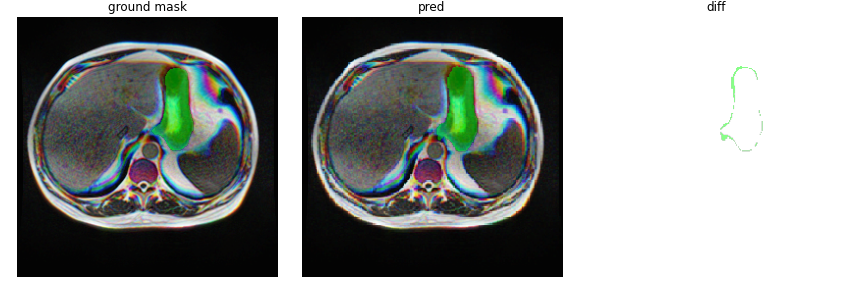

# UWA-Image Segmentation

Kaggle medical image segmentation project. End-to-end from training to inference. Tensorflow/keras implementation

---

Dataset found on: https://www.kaggle.com/competitions/uw-madison-gi-tract-image-segmentation/data

---

Ensure that PATH_DIR points to the train/ folder in the dataset given above.

2.5D UNet with processed skip connections

Multiple models investigated + various architectural blocks (commented out in jupyter notebook):
e.g:
- https://arxiv.org/abs/1909.00166
- https://arxiv.org/abs/1902.04049
- https://arxiv.org/abs/2003.05056

**Augmentations:**
- Colour normalization via CLAHE
- Colour augmentation ("possibly omit in the context of 2.5D inputs)
- Scale/zoom/rotate augmentation
- Flip augmentation
- Coarse cutout (shamelessly stolen from another person on kaggle)

